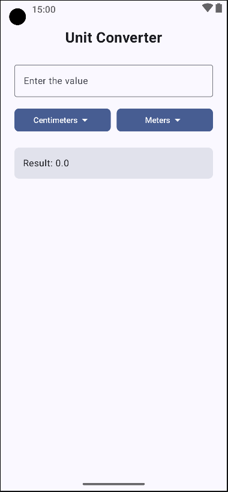

# Unit Converter

O **Unit Converter** é um aplicativo Android desenvolvido com Jetpack Compose que permite converter valores entre diferentes unidades de medida (centímetros, metros, pés e milímetros) de forma rápida e intuitiva.

## 📱 Tela do Aplicativo

Abaixo, veja uma captura de tela do aplicativo:

## 💡 Funcionalidades

- **Entrada de Valor:** Permite ao usuário digitar o valor a ser convertido.
- **Seleção de Unidades:** Dois menus dropdown permitem escolher:
    - A unidade de origem (por exemplo, "Centimeters", "Meters", "Feet", "Millimeters").
    - A unidade de destino para a conversão.
- **Conversão Automática:** O aplicativo converte o valor baseado no fator correspondente entre as unidades selecionadas e exibe o resultado.
- **Interface com Jetpack Compose:** Layout moderno e dinâmico utilizando componentes do Material3.

## 📂 Estrutura do Projeto

A organização principal do projeto inclui:

- **MainActivity.kt:** Configura o tema e chama a função `UnitConverter()`, que gerencia a lógica principal do aplicativo.
- **UnitConverter Composable:** Responsável pela disposição dos componentes na tela, incluindo o campo de entrada, menus dropdown e campo de resultado.
- **UnitDropdownMenu.kt:** Componente composable customizado para exibir um botão que, ao ser clicado, mostra um menu para selecionar a unidade.
- **ResultField.kt:** Componente que calcula e exibe o resultado da conversão com base na entrada e nas unidades escolhidas.

## 🚀 Tecnologias Utilizadas

- **Linguagem:** Kotlin
- **Framework UI:** Jetpack Compose (Material3)
- **Arquitetura:** Componentes e funções composable para criação de interfaces reativas